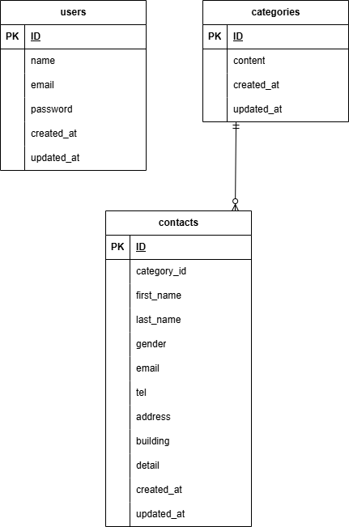

# お問い合わせフォーム

このリポジトリは、laravelを利用した 基礎学習ターム 確認テスト お問い合わせフォームアプリです。

## 環境構築

#### リポジトリをクローン

```
git clone git@github.com:koko-chii/FashionablyLate.git
```

#### ディレクトリの移動

```
cd FashionablyLate/src
```

#### .env ファイルの作成

```
cp .env.example .env
```

#### .env ファイルの修正

```
DB_CONNECTION=mysql
DB_HOST=mysql
DB_PORT=3306
DB_DATABASE=FashionablyLate_db
DB_USERNAME=FashionablyLate_user
DB_PASSWORD=FashionablyLate_pass

```

#### ディレクトリの移動

```
cd ..
```

#### コンテナの起動

```
docker compose up -d
```

#### PHPライブラリのインストール

```
docker compose exec -u 1000 php composer install
```
### キー生成

```
docker compose exec php php artisan key:generate
```

#### 権限の付与

```
docker compose exec php chmod -R 777 storage bootstrap/cache
```

#### マイグレーション・シーディングを実行

```
docker compose exec -u 1000 php php artisan migrate --seed
```

## 使用技術（実行環境）

フレームワーク: Laravel 13.4.0x

言語：PHP 8.3

Webサーバー：Nginx 1.21.1

データベース：mySQL 8.0.26

## ER図



## URL

アプリケーション：http://localhost/

phpMyAdmin：http://localhost:8080


